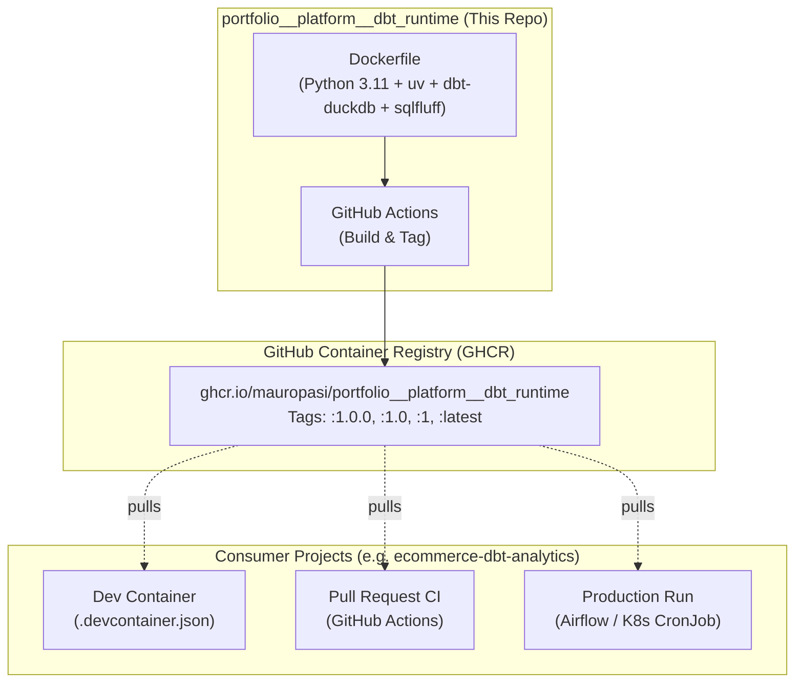

# portfolio__platform__dbt_runtime

A standardized, pre-baked container runtime providing the execution engine for downstream analytics projects (such as `ecommerce-dbt-analytics`).

This repository acts as the **Platform / Infrastructure layer** in a governed data platform architecture. It builds, verifies, and publishes the immutable container image used across local Dev Containers, CI validation pipelines, and production batch orchestrators.

---

## Architecture Overview



---

## Key Design Principles

1. **Separation of Concerns:**
   - **System Dependencies** (`python`, `uv`, `dbt-core`, `dbt-duckdb`, `sqlfluff`) are baked here.
   - **Code Dependencies** (SQL models, seeds, `packages.yml`) live strictly in the consumer project repositories.
2. **Matrix Builds from a Single Source of Truth:**
   - A single parameterized `Dockerfile` uses Docker build arguments (`DBT_PACKAGES`, `TOOLS_VERSION`) to build multiple versions concurrently in GitHub Actions without branch proliferation:
     - **Flavor 1 (Latest 1.x):** `dbt-core==1.12.5`, `dbt-duckdb`, `duckdb`, `tools=v1` (Tagged `:1.12`, `:1`, `:v1`, `:latest`, `:main`).
     - **Flavor 2 (Next Gen v2):** `dbt>=2.0.0`, `duckdb`, `tools=v1` (Tagged `:2.0`, `:2`, `:v2`).
3. **Decoupled Script Versioning (`scripts/v1/`, `scripts/v2/`):**
   - Platform helper scripts (like `init_duckdb.py`) are versioned in subfolders under `scripts/`.
   - Bumping dbt versions does not require touching scripts; and conversely, introducing breaking changes to internal helper scripts is managed via `TOOLS_VERSION=v2` without breaking older image flavors.
4. **Fast & Lightweight:**
   - Uses `python:3.11-slim-bookworm` to keep image size compact (~350MB vs ~1.5GB typical devcontainer images).
   - Uses `uv` for ultra-fast, deterministic package installation.
5. **Non-Root Execution:**
   - Pre-configures a `vscode` user (UID/GID `1000`) with passwordless sudo, ensuring seamless bind-mount permissions when used in VS Code / Antigravity Dev Containers.

---

## Local Development & Testing

A `Makefile` is provided for local maintenance:

```bash
# View available make targets
make help

# Build the default image locally (dbt 1.12)
make build

# Build specific flavors locally
make build-v1
make build-v2

# Run smoke tests (verifies dbt, sqlfluff, and duckdb execute cleanly)
make test

# Open an interactive shell inside the container
make run
```

---

## CI/CD Pipeline

The workflow defined in [`.github/workflows/build-and-publish.yml`](file:///.github/workflows/build-and-publish.yml) automates the release lifecycle:
- On Pull Requests: Builds the image and runs smoke tests to verify integrity without pushing.
- On merge to `main` or semantic release tags (`v*.*.*`): Builds with GitHub Actions cache and pushes to `ghcr.io`.

---

## Roadmap & TODOs

- [ ] **Container Vulnerability Scanning:** Integrate [Trivy](https://github.com/aquasecurity/trivy-action) in the CI pipeline to automatically fail builds on critical/high CVEs.
- [ ] **Multi-Architecture Builds:** Enable Docker Buildx for `linux/amd64` and `linux/arm64` (Apple Silicon support).
- [ ] **Automated Base Image Updates:** Configure Dependabot or Renovate to trigger PRs when upstream Debian or Python base images receive security updates.
